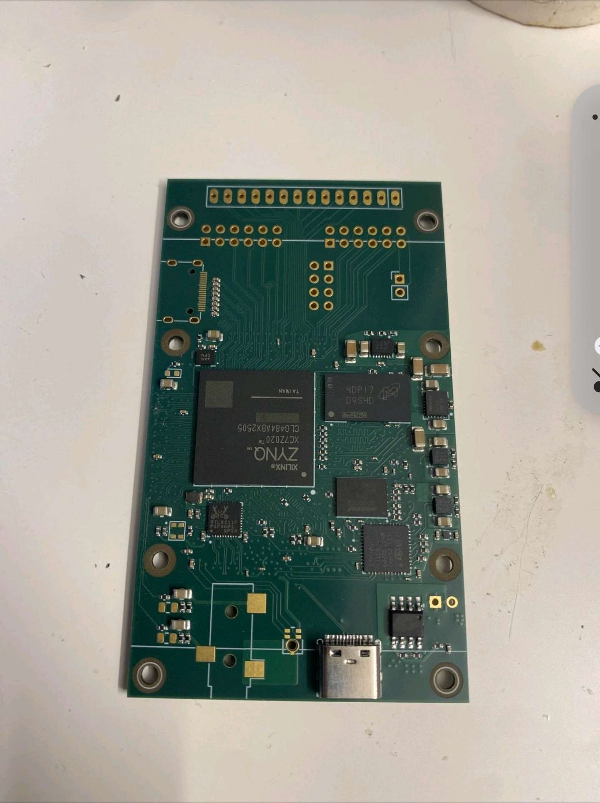
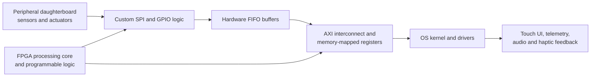

# SIDEKICK — The Smartphone Project

**SIDEKICK, previously named TheSmartphoneProject, is a student-led effort at DIGITAL @ Cal Poly Pomona to design a modular smartphone around an FPGA-based computing platform.** It treats the phone as one integrated product spanning programmable logic, circuit design, embedded software, operating systems, sensing, user interaction, mechanical design, and thermal engineering.

  

<em>FPGA smartphone mainboard prototype. <a href="https://photos.app.goo.gl/fKSVxjnxUvrLaF7E6">View the project photo album.</a></em>

This repository consolidates the project's previously distributed engineering record. It contains original design files, subsystem iterations, planning documents, curricula, and project updates. It is an archival engineering snapshot—not a claim that every subsystem reached production readiness or that the files currently assemble into a finished phone.

## Project Definition

The project aims to engineer a working, custom-built mobile-device prototype whose central processing and hardware-control functions are implemented with field-programmable logic. Inspired by modern mobile architecture and open-source hardware, the team uses tools including KiCad, SolidWorks, ANSYS, AMD Vivado, and OrCAD to expose parts of the system that are normally hidden inside closed silicon and proprietary product stacks.

The intended phone should be comfortable to hold, intuitive to navigate, responsive under real use, and efficient enough for sustained daily operation. Success is therefore broader than a booting circuit board: the project pairs user evaluation of ergonomics, navigation, and responsiveness with engineering measurements such as clock speed, bus bandwidth, screen-on time, battery discharge, component efficiency, data integrity, latency, and thermal behavior.

As an educational platform, the phone gives students a way to follow a complete system from physical circuits and programmable logic through hardware interfaces, drivers, the operating system, and the user experience. The objective is not only a device, but a reusable foundation for learning, experimentation, repairability, and later product iterations.

## Planned Operational Architecture

The system concept separates the FPGA motherboard from modular peripheral hardware. Custom logic moves device data through controller and buffering stages into an AXI-based system fabric, where software drivers expose it to the operating system and user interface.

Representative system flows include:

- **Boot and biometric unlock:** power-rail bring-up, FPGA bitstream loading, kernel and driver initialization, fingerprint transfer, authentication, haptic confirmation, and UI unlock.
- **Continuous sensor telemetry:** IMU, temperature, ambient-light, and microphone sampling; serial-to-parallel conversion; cross-clock FIFO buffering; AXI transfer; and UI updates.

The current systems plan treats a peripheral-to-memory latency below 15 ms, lossless sensor-packet handling at the target sampling load, and passive heat routing away from user touchpoints as design requirements. These are project targets documented in the planning workspace, not certifications of the archived hardware.

## Development approach

The project follows a systems-engineering cycle:

1. define the product, user experience, and measurable requirements;
2. decompose the phone into coordinated electrical, computing, software, mechanical, and thermal workstreams;
3. select components and tools, establish interfaces, and procure hardware;
4. design and prototype subsystems independently;
5. integrate through defined buses, connectors, drivers, and mechanical boundaries;
6. test electrical, performance, power, thermal, usability, and integration risks; and
7. evaluate readiness, document results, and carry lessons into the next iteration.

The public [TheSmartphoneProject workspace](https://successful-twill-84f.notion.site/TheSmartphoneProject-3e3169473d7780c18205ee25701566bf) contains the living planning record, including the product definition, requirements, work breakdown, use-case material, sequence diagrams, activity diagrams, team plans, and subsystem task tracking. Some linked workspace records may have separate access controls.

## System overview

| Subsystem | Scope | Contents |
| --- | --- | --- |
| [FPGA main board and peripheral board](subsystems/fpga-mainboard/) | Central Zynq/FPGA architecture, power, RF/transceiver, USB, connectors, display peripheral board | KiCad source, fabrication outputs, 3D renders, manufacturing notes |
| [Haptics](subsystems/haptics/) | Tactile-feedback motor-driver board | KiCad project archive |
| [Fingerprint sensor](subsystems/fingerprint-sensor/) | Fingerprint-sensor interface board | KiCad project archive |
| [Flashlight](subsystems/flashlight/) | LM3644-based flashlight/LED driver | KiCad revisions and symbol/footprint library |
| [Mechanical and thermal](subsystems/mechanical-thermal/) | Phone enclosure, frame, assembly, and thermal/mechanical exploration | STEP, STL, SolidWorks, PDF, and archived CAD models |
| [Ambient-light sensor](subsystems/ambient-light-sensor/) | VCNL4030X01-based sensing board and additional light-sensor iterations | KiCad project archives and STEP model |
| [IMU](subsystems/imu/) | ICM-20948 inertial-sensing board and supporting power/level shifting | Seven chronological KiCad project archives |
| [Real-time clock](subsystems/real-time-clock/) | RV-3028-C8-based RTC board | KiCad source, component library, renders, schematics, and prototype outputs |
| [STM32 controller](subsystems/stm32-controller/) | STM32G431-based control and support electronics | KiCad design, component models/libraries, and STM32CubeIDE firmware project |
| [Heat sensor](subsystems/heat-sensor/) | Temperature/heat-sensing circuit exploration | KiCad schematic project archive |

## Project documentation

The [`documentation/`](documentation/) directory preserves the project record alongside the subsystem engineering files. It includes Hatchery proposals and phase updates, DIGITAL curriculum and mini-project decks, the project budget and bill-of-materials workbook, and organizational records. These originals are grouped by purpose and accompanied by checksums and provenance notes.

## Repository organization

Each subsystem has:

- a short README explaining what is present;
- a `PROVENANCE.md` with the original repository, branch, imported commit, and contributors; and
- a `source/` directory containing an unchanged snapshot of the files tracked at that commit.

The snapshots intentionally retain original filenames, archive structure, and intermediate revisions. This avoids silently selecting a “final” design where the source repository did not designate one.

## Opening the design files

Most electronics work is stored as KiCad projects, either directly or inside ZIP archives. Mechanical work includes STEP, STL, SolidWorks (`.SLDPRT`), and PDF files. Some archives contain KiCad automatic backups in addition to the latest project files.

Treat all outputs as historical engineering artifacts. Review schematics, footprints, stackups, component availability, electrical rules, and manufacturing requirements before fabrication.

## Project history and attribution

The initial source material was maintained across seven repositories under individual contributors and the DIGITAL organization. Additional project archives supplied directly by the project maintainer are recorded separately, without inferring authorship or repository history. See [CONTRIBUTORS.md](CONTRIBUTORS.md) for the contributor index and each subsystem's `PROVENANCE.md` for source details.

No authorship is transferred by this consolidation. Original Git history remains available through the linked source repositories and the immutable commit identifiers recorded here.

## Licensing

Licensing is **per subsystem**, not repository-wide. The FPGA/main-board snapshot includes its original GNU GPL v3 license. No explicit license file was present in the other source repositories at the recorded commits. See [LICENSES.md](LICENSES.md) before reusing or redistributing any material.

## About DIGITAL

DIGITAL is a cross-disciplinary student product-development organization at Cal Poly Pomona. SIDEKICK reflects the core challenge of integrated product work: many specialized teams contributing to one coherent system.
